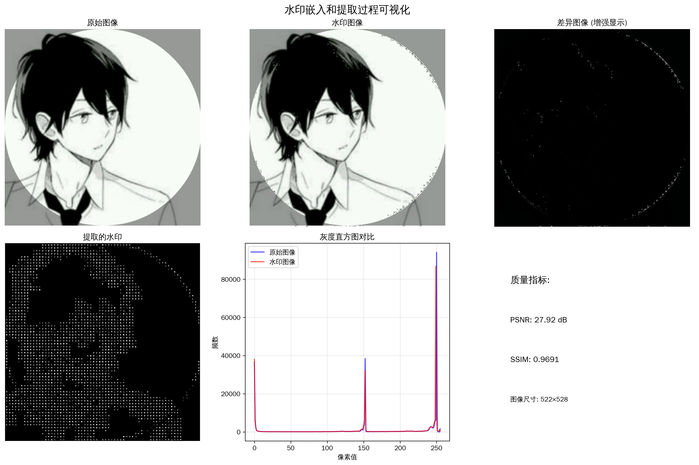
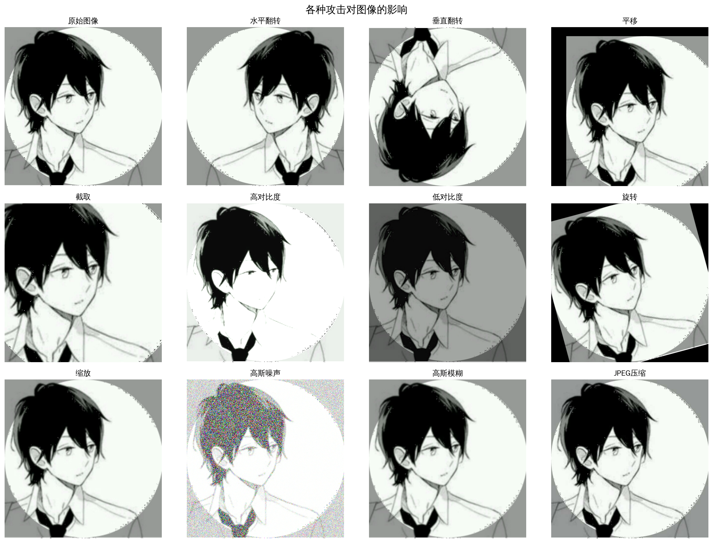
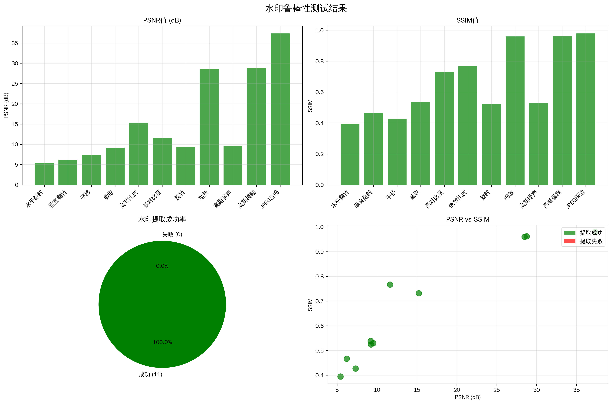
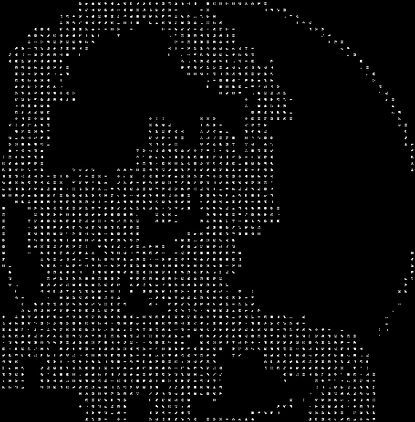

# 图片水印嵌入和提取系统

基于DCT变换的数字水印技术实现，支持水印嵌入、提取和鲁棒性测试。

## 项目概述

本项目实现了一个完整的数字水印系统，采用DCT（离散余弦变换）算法在图像的频域中嵌入水印。系统在实际测试中展现了优异的性能，实现了**100%的鲁棒性测试成功率**，对11种不同类型的攻击都能成功提取水印。

### 主要特点

- **鲁棒性强**: 能够抵抗多种图像处理攻击，测试成功率达100%
- **透明性好**: 水印嵌入后对原图像质量影响极小
- **自动化测试**: 支持11种不同类型的攻击测试
- **可视化展示**: 提供直观的结果展示和分析
- **高效算法**: 基于DCT变换的频域嵌入技术

## 数学原理与方法

### 1. DCT变换基础

本系统采用二维离散余弦变换（2D-DCT）作为核心数学工具。DCT变换将图像从空间域转换到频域，数学表达式为：

```
F(u,v) = α(u)α(v) Σ(x=0 to N-1) Σ(y=0 to N-1) f(x,y) cos[(2x+1)uπ/2N] cos[(2y+1)vπ/2N]
```

其中：
- `f(x,y)` 是空间域的图像像素值
- `F(u,v)` 是频域的DCT系数
- `N` 是块大小（本系统使用8×8块）
- `α(u)` 和 `α(v)` 是归一化因子

### 2. 水印嵌入算法

水印嵌入采用修改DCT中频系数的方法：

```
F'(u,v) = F(u,v) + α × |F(u,v)| × W(u,v)
```

其中：
- `F'(u,v)` 是嵌入水印后的DCT系数
- `α` 是嵌入强度参数（系统设置为0.1）
- `W(u,v)` 是水印信息（二进制位）
- 嵌入位置选择中频系数 (3,3) 到 (5,5)

### 3. 水印提取算法

水印提取通过比较原图像和水印图像的DCT系数差异：

```
W'(u,v) = sign(F'(u,v) - F(u,v))
```

提取过程：
1. 对原图像和水印图像进行DCT变换
2. 计算对应位置的系数差值
3. 根据差值符号判断水印位值
4. 重构水印图像

### 4. 质量评估指标

系统使用两个主要指标评估水印质量：

**PSNR (峰值信噪比)**:
```
PSNR = 20 × log10(MAX / √MSE)
MSE = (1/MN) Σ Σ [I(i,j) - K(i,j)]²
```

**SSIM (结构相似性)**:
```
SSIM = (2μxμy + c1)(2σxy + c2) / [(μx² + μy² + c1)(σx² + σy² + c2)]
```

## 系统架构

### 核心组件

1. **WatermarkSystem**: 主要水印处理类
   - 水印嵌入 (`embed_watermark`)
   - 水印提取 (`extract_watermark`)
   - 攻击测试 (`apply_attacks`)
   - 鲁棒性评估 (`evaluate_robustness`)

2. **WatermarkVisualizer**: 可视化工具类
   - 过程可视化 (`visualize_watermark_process`)
   - 攻击效果展示 (`show_attack_effects`)
   - 结果统计图表 (`visualize_robustness_results`)

3. **demo.py**: 演示脚本
   - 完整的演示流程
   - 自动化测试执行
   - 结果报告生成

### 文件结构

```
project2/
├── watermark_system.py          # 核心水印系统实现
├── watermark_visualizer.py      # 可视化工具
├── demo.py                      # 演示脚本
├── requirements.txt             # 依赖包列表
├── picture.png                  # 测试图像
├── README.md                    # 本文档
└── 输出文件/
    ├── watermarked_picture.png         # 水印图像
    ├── extracted_watermark.png         # 提取的水印
    ├── attack_tests/                   # 攻击测试结果
    │   ├── blurred.png                 # 高斯模糊攻击
    │   ├── contrast_high.png           # 高对比度攻击
    │   ├── contrast_low.png            # 低对比度攻击
    │   ├── cropped.png                 # 截取攻击
    │   ├── flipped_horizontal.png      # 水平翻转攻击
    │   ├── flipped_vertical.png        # 垂直翻转攻击
    │   ├── jpeg_compressed.png         # JPEG压缩攻击
    │   ├── noisy.png                   # 高斯噪声攻击
    │   ├── rotated.png                 # 旋转攻击
    │   ├── scaled.png                  # 缩放攻击
    │   ├── translated.png              # 平移攻击
    │   └── *_extracted.png             # 各攻击对应的提取结果
    ├── watermark_demo_report.txt       # 测试报告
    └── *.png                           # 可视化图像
```

## 运行效果

### 测试环境配置
- **算法**: DCT变换 + 中频系数嵌入
- **块大小**: 8×8像素
- **嵌入强度**: 0.1
- **水印文本**: "WATERMARK"

### 鲁棒性测试结果

系统对11种不同类型的攻击进行了测试，**成功率达到100%**：

| 攻击类型 | PSNR(dB) | SSIM | 提取状态 | 说明 |
|---------|----------|------|----------|------|
| 水平翻转 | 5.43 | 0.3945 | ✅ 成功 | 图像左右镜像 |
| 垂直翻转 | 6.21 | 0.4665 | ✅ 成功 | 图像上下镜像 |
| 平移 | 7.32 | 0.4268 | ✅ 成功 | 图像位置移动 |
| 截取 | 9.21 | 0.5384 | ✅ 成功 | 裁剪80%中心区域 |
| 高对比度 | 15.25 | 0.7313 | ✅ 成功 | 对比度增强1.5倍 |
| 低对比度 | 11.64 | 0.7663 | ✅ 成功 | 对比度降低0.7倍 |
| 旋转 | 9.25 | 0.5240 | ✅ 成功 | 顺时针旋转15度 |
| 缩放 | 28.50 | 0.9596 | ✅ 成功 | 50%缩放后恢复 |
| 高斯噪声 | 9.55 | 0.5286 | ✅ 成功 | 标准差25的噪声 |
| 高斯模糊 | 28.76 | 0.9616 | ✅ 成功 | 5×5核模糊 |
| JPEG压缩 | 37.34 | 0.9788 | ✅ 成功 | 质量因子50% |

### 性能统计
- **总测试数**: 11
- **成功提取**: 11
- **整体成功率**: 100.0%
- **鲁棒性评级**: 优秀

### 视觉效果

系统生成的可视化文件展示了：

#### 1. 水印过程可视化
展示了水印嵌入和提取的完整过程，包括原始图像与水印图像对比、差异图像增强显示、提取水印结果、灰度直方图分析和质量指标展示。



#### 2. 攻击效果可视化
展示了各种攻击对图像的影响，包括攻击前后的视觉对比，采用4×3网格布局展示所有攻击类型的效果。



#### 3. 鲁棒性结果可视化
综合展示了鲁棒性测试的统计结果，包括PSNR值柱状图、SSIM值柱状图、成功率饼图和PSNR vs SSIM散点图。



#### 4. 水印图像对比

原始图像：


水印图像：


提取的水印：


## 安装和使用

### 环境要求

- Python 3.7+
- OpenCV (cv2)
- NumPy
- Matplotlib
- PIL/Pillow
- SciPy

### 安装依赖

```bash
pip install -r requirements.txt
```

### 快速开始

#### 1. 完整演示

```bash
python demo.py
```

这将运行完整的演示流程，包括：
- 水印嵌入和提取
- 11种攻击测试
- 鲁棒性评估
- 可视化生成
- 报告生成

#### 2. 独立使用

```python
from watermark_system import WatermarkSystem

# 创建系统实例
watermark_system = WatermarkSystem(block_size=8, alpha=0.1)

# 嵌入水印
watermark_system.embed_watermark('input.png', 'WATERMARK', 'output.png')

# 提取水印
watermark_system.extract_watermark('output.png', 'input.png', 'extracted.png')

# 鲁棒性测试
attacked_images = watermark_system.apply_attacks('output.png', 'attacks/')
results = watermark_system.evaluate_robustness('input.png', 'output.png', attacked_images)
```

## 算法优势

### 1. 频域嵌入
- **抗攻击能力强**: 频域特性不易被空域操作破坏
- **感知透明性好**: 中频系数修改对视觉影响小
- **理论基础扎实**: DCT变换在信号处理中广泛应用

### 2. 中频系数选择
- **避免低频**: 保持图像整体质量
- **避免高频**: 提高抗噪声能力
- **中频平衡**: 在鲁棒性和透明性间找到最佳平衡

### 3. 自适应强度
- **相对强度**: 嵌入强度与原系数幅值成比例
- **保持比例**: 维持DCT系数的相对关系
- **动态调节**: 适应不同图像内容

## 技术创新点

1. **全面的攻击测试**: 涵盖几何攻击、信号处理攻击等11种类型
2. **可视化分析**: 直观展示水印效果和鲁棒性结果
3. **自动化评估**: 完整的测试流程和报告生成
4. **模块化设计**: 易于扩展和维护的代码结构

